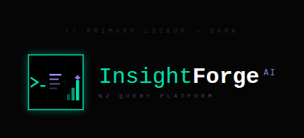
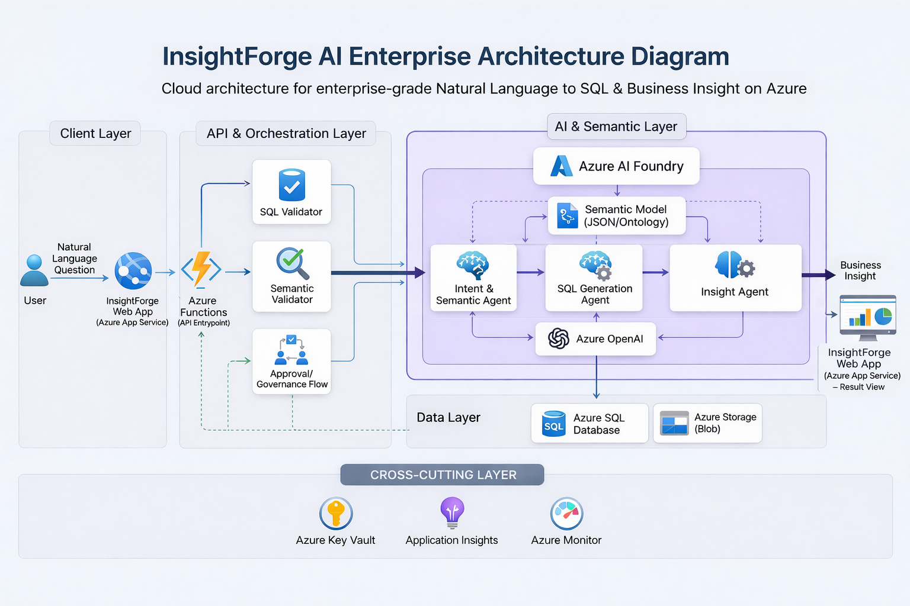

<div align="center">
  

  <h1>InsightForge AI</h1>
  <h3>The Enterprise SQL Intelligence Layer</h3>

  <p>
    <b>English</b> | <a href="README_es.md">Español</a>
  </p>

  <p>
    <a href="docs/InsightForge_AI_Governed_Fraud_Analytics%20final.pdf">
      
    </a>
    <a href="https://drive.google.com/file/d/13gjSoslyX_HqGxrytA1JkD9LUGc-wL3j/view?usp=sharing">
      
    </a>
  </p>

  <p>
    <a href="#-the-solution"><b>Platform Overview</b></a> |
    <a href="#-key-features"><b>Key Features</b></a> |
    <a href="#-architecture--tech-stack"><b>Architecture</b></a> |
    <a href="#-quick-start-judges-corner"><b>Quick Start</b></a>
  </p>

  <p>
    
    
    
    
    
  </p>

  <p>
    ⭐ <b>Like what we're doing? Give us a star!</b> ⬆️
  </p>
</div>

---

**InsightForge AI (QueryPilot)** empowers analysts with governed, deterministic AI-driven data insights while maintaining absolute security on Azure infrastructure. 

## 🚨 The Problem

In the fast-paced world of **fraud detection** and financial analytics, time is of the essence. Yet, highly skilled domain experts (like Fraud Analysts) often face severe bottlenecks:
- **The SQL Barrier:** Analysts depend on data engineers to write complex queries, delaying critical insights.
- **The "Rogue AI" Risk:** Standard LLMs hallucinate table names or, worse, expose highly sensitive Personally Identifiable Information (PII) without governance.
- **Lack of Traceability:** Traditional chat-to-database tools lack the enterprise audit trails and human oversight required in regulated industries.

## 💡 The Solution

InsightForge AI bridges the gap between natural language and complex relational databases. It is not just another "text-to-SQL" wrapper; it is an **enterprise-grade, Human-in-the-Loop orchestration engine**. 

By enforcing strict governance, safe AI execution, and transparent auditability, InsightForge AI allows non-technical domain experts to interrogate massive datasets securely, receiving both accurate data and executive-ready explanations.

## ✨ Key Features & Value Proposition

- 🗣️ **Conversational Analytics (Zero Code):** Analysts ask business questions in natural English or Spanish. QueryPilot maps the intent and generates highly optimized SQL instantly.
- 🛡️ **Ironclad Governance & Human-in-the-Loop:** When a query touches sensitive constraints (e.g., VIP accounts or confidential risk scores), the system *pauses execution*. The query is quarantined until a designated human capability approves or rejects the action.
- 🔒 **Responsible AI Security:** Integrated seamlessly with **Azure AI Content Safety**, instantly blocking prompt injections, abusive language, or unauthorized data exfiltration attempts.
- 📊 **Executive Translation:** We don't just return rows and columns. Our secondary AI agents interpret the tabular results and draft an executive summary explaining the findings in the context of fraud risk.
- 👁️ **Total Observability:** Every intent, generated query, execution time, and AI decision is logged securely for compliance parsing.

### 📈 Business Impact (Expected ROI)
* ⏳ **Time-to-Insight:** Drastically reduced from 3-5 days (waiting on Data Engineering bottlenecks) to under **30 segundos**.
* 💰 **Operational Savings:** Eliminates the SQL technical bottleneck, saving organizations hundreds of expensive Data Engineering hours monthly.
* 🛡️ **Risk Mitigation:** Immediate, on-demand insights enable faster reactions to emerging fraud patterns, directly reducing financial exposure.

## ⚙️ Enterprise Architecture Blueprint

<div align="center">
  
</div>

> **Diagram Flow:** The architecture illustrates the end-to-end integration of our Tech-Brutalist Next.js UI, the Azure API Gateway, the Durable Functions State Orchestrator handling approvals, and the multi-agent AI framework (Query Planner, Data Executor, Executive Explainer).

---

## 📸 Platform Experience

### 1. Data Source Hub


> **Insight:** The central command interface where analysts manage their active database connections. The unified workspace allows users to easily toggle between different data environments (e.g., specific Azure SQL nodes or Postgres servers) to interrogate data without ever writing a connection string.

### 2. Seamless Secure Integrations


> **Insight:** Adding a new enterprise database is frictionless. Through the *"Add New Integration"* flow, users securely input host, database, and credential details. In the background, QueryPilot orchestrates the connection validation via the .NET API and securely proxies the credentials to Azure Key Vault, maintaining absolute Zero-Trust compliance.

### 3. Enterprise Database Configuration


> **Insight:** While Azure SQL is our flagship integration showcasing high-security standards, the architecture is highly extensible by design. We support configuring multiple connection modalities depending on the enterprise's topology. Additional configurations such as PostgreSQL, MySQL, and other primary databases are easily integrated via the same secure gateway protocol.

### 4. Active Connection State


> **Insight:** Once validated via our secure API pathway, the data source shifts to an active, connected state providing live feedback. Analysts are immediately ready to query schemas securely, accelerating time-to-insight without technical friction.

### 5. Conversational Analytics Interface


> **Insight:** Once connected, analysts can interrogate the database using natural language. The intelligent Engine securely translates questions into highly optimized SQL, executes them against the database, and returns both the raw data and an executive-level summary of the findings—completely abstracting the technical barrier.

### 6. Transparent Audit & Execution Logs


> **Insight:** Trust is paramount in enterprise fraud analytics. Every natural language query is accompanied by a transparent "terminal" view showing exactly what SQL was generated, what backend logic executed, and exactly how long the operations took. This deterministic observability is crucial for compliance and IT auditability.

### 7. Natural Language Interaction


> **Insight:** The unified chat interface empowering analysts to ask plain-English (or Spanish) questions like *"Show me the accounts with the highest transaction volumes"*. The minimalist, Tech-Brutalist design removes cognitive overload, letting the user focus purely on the objective while the multi-agent system runs securely in the background.

### 8. Executive Insight Generation


> **Insight:** Going beyond traditional outputs. Instead of merely returning a sterile table of rows and columns, InsightForge AI provides a rich, executive-style markdown summary interpreting the findings. This instantly contextualizes the data, eliminating hours of manual reporting for Fraud Analysts.

<br />

## ⚙️ Architecture & Tech Stack (Powered by Azure)


We built InsightForge AI to be robust, scalable, and inherently secure from day one.

- **Intelligence:** Azure OpenAI (GPT-4o-mini) distributed through intelligent agents.
- **Safety:** Azure AI Content Safety.
- **Orchestration:** Azure Durable Functions (Stateful Serverless) + .NET 8.
- **Experience Layer:** Next.js / React with a premium *Tech-Brutalist / Deep Void* aesthetic.
- **Data Hub:** Azure SQL Database (Protected via Managed Identities).

---

## 🏆 Hackathon Evaluation Criteria

| Criteria | Weight | Description |
| :--- | :---: | :--- |
| **Performance** | 25% | How optimal, efficient, and functional the solution is natively. |
| **Innovation** | 25% | How novel the proposal is compared to current market text-to-SQL solutions. |
| **Azure Services Usage** | 25% | Deep integration evidenced through our architecture and utilized cloud components (OpenAI, SQL, Durable Functions, Monitor). |
| **Responsible AI** | 25% | Strict compliance with the 6 core principles: Fairness, Reliability & Safety, Privacy & Security, Inclusiveness, Transparency, and Accountability via our Human-in-the-loop and Content Safety implementations. |

---

## 🚀 What's Next (Roadmap)
InsightForge AI is built as a foundation for enterprise analytics. Our immediate roadmap includes:
- **Expanded BI Integrations:** Seamless export layer connecting directly to PowerBI and Tableau.
- **Voice-to-SQL Agents:** Enabling native speech-to-query capabilities for executives on the go.
- **Predictive Fraud Templates:** Pre-built agent macros to auto-detect emerging fraud rings based on historical variance analysis.

---

## 🛠️ Quick Start (Judge's Corner) <a id="quick-start"></a>

<details>
<summary><b>🛠️ Click to expand instructions for local execution</b></summary>
<br />

*Note: For the hacking period, actual backend configuration variables are located in `docs/CLAVES_Y_CREDENCIALES.md`.*

### Running the Project Locally

**1. Start the Orchestration API (Backend)**
```powershell
cd C:\Users\Jessy\Documents\GitHub\QueryPilotAI\backend\src\Functions.Api
func start
```

**2. Start the Client UI (Frontend)**
```powershell
cd C:\Users\Jessy\Documents\GitHub\QueryPilotAI\frontend
npm run dev
```

**3. Sanity Check SQL Connection**
```powershell
# In a new terminal, verify the functions are talking to Azure SQL securely:
Invoke-RestMethod -Method Post -Uri "http://localhost:3000/api/test-connection" -Body (@{ type="Azure SQL"; host="tcp:<YOUR_DB_HOST>"; database="<YOUR_DB>"; username="<USER>"; password="<PWD>" } | ConvertTo-Json) -ContentType "application/json"
```

</details>

<br />

<div align="center">
  <h3>👥 Authors</h3>
  <p>
    <b>Team Microsoft Hackathon 2026</b><br/>
    Project: Cognitive Multi-agent Orchestrator<br/>
    Date: March 27, 2026
  </p>
  
  <i>Developed with passion, ethics, and future vision 💙</i><br/><br/>
  
  <a href="https://github.com/darovero/QueryPilotAI">Return to top</a>
</div>
